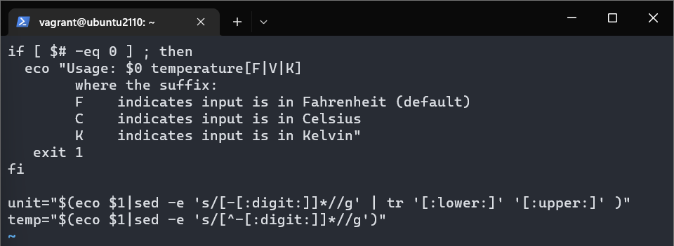
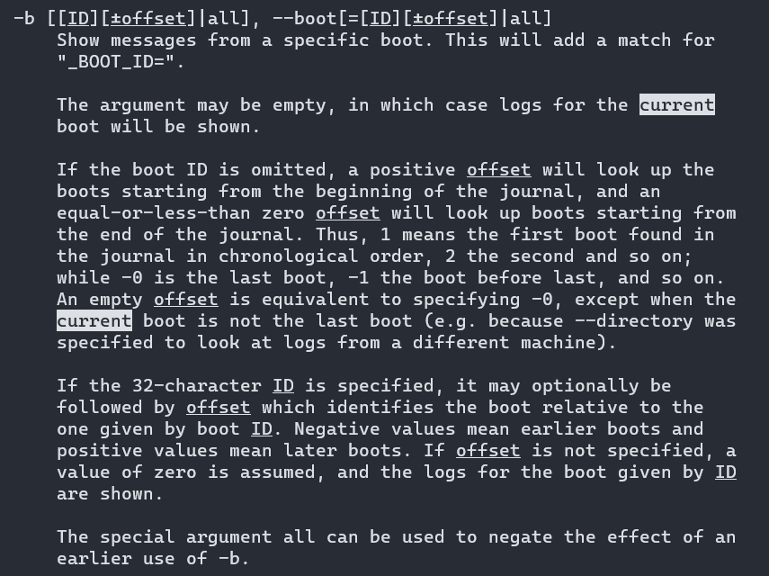
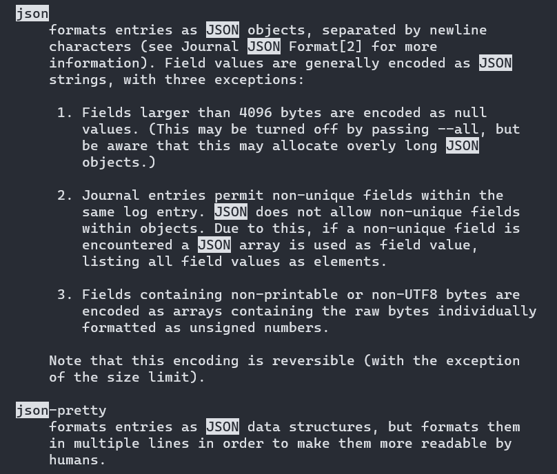

# ACIT 2420 - Final Exam 

### Part 1 
* sudo apt update && sudo apt upgrade 

### Part 2 
* Line 1: Change 1 to 0 by typing "r" and then "0" to replace 1 
* Line 5: Change V by C by typing "r" and then "C" to replace V
* Line 10: %s/numbs/:digit: to search for "numbs" and replace with ":digit:" <br/>
Since there is only 1 "numbs" in the file, it would be okay to change it with %s to search for the word and replace it with another word. 



### Part 3 




```Shell 
#!/bin/bash

journalctl -b 0 -o json-pretty
```

### Part 4 
```Shell
#!/bin/bash

USERS=$(grep -E '(1[0-9]{3}|5000)' /etc/passwd | awk -F':' '{ printf $1" "$3" "$7" " }')

WHO=$(whoami)

echo "Regular users on the system are:"
#echo ${USERS}

for i in ${USERS}; do
 echo ${i}
done


echo "Users currently logged in are:"
echo $WHO
```

### Part 5


### Part 6 

```Shell 
[Unit]
Description=Timer to start Part 3 service file one minute after booting everyday while it is active

[Timer]
OnBootSec=1min
Persistent=true

[Install]
WantedBy=timers.target
```
* sudo systemctl start part6.timer 
* sudo systemctl enable part6.timer 
* sudo systemctl status part6.timer 